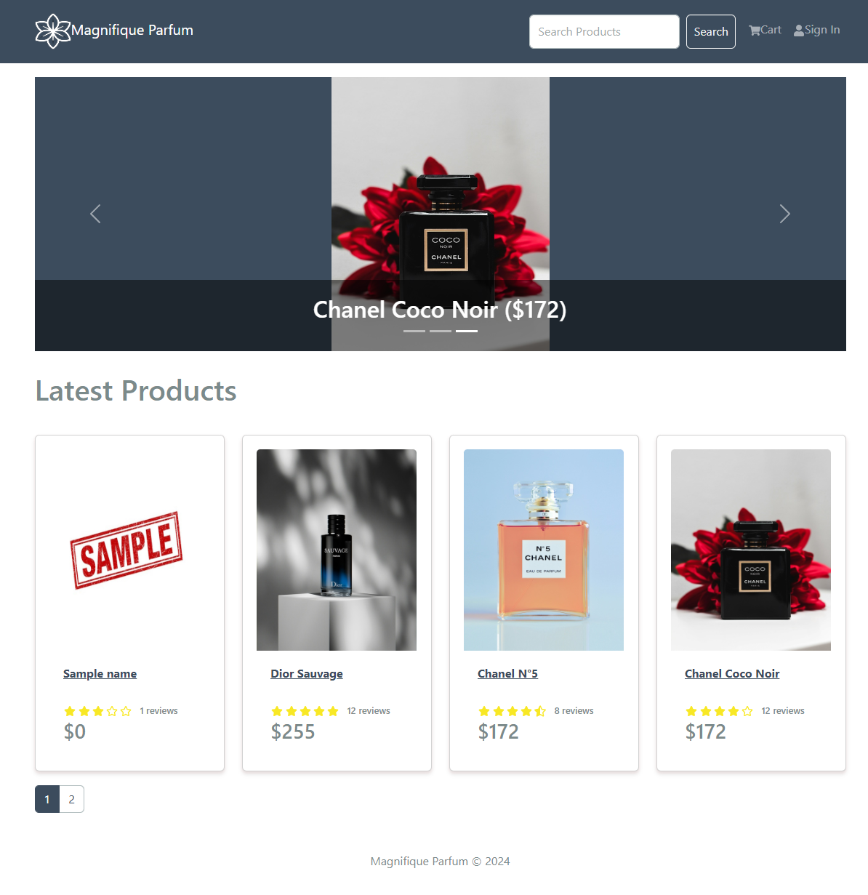

# [Magnifique Parfum eCommerce Platform](https://magnifique-parfum.onrender.com/)

# Description

This is an eCommerce web application created with the MERN stack. Features include a shopping cart, product reviews/ratings, search, user authentication system, user profile, admin product/user management tools, admin order details page with the ability to mark orders as delivered, checkout process, and PayPal integration for payment.

 

  
  
  
  
  
  

## Live Website
Live website is hosted using Render at: https://magnifique-parfum.onrender.com/

_The first time opening the website, it will take a while to load due to Render's free tier spinning down after 15 minutes without receiving traffic. After fully loading, the website will be more reactive._

## Built with
- NodeJs
- Express
- ReactJs
- Redux
- MongoDb
- Bootstrap
- Axios
- Bcrypt
- JWT
